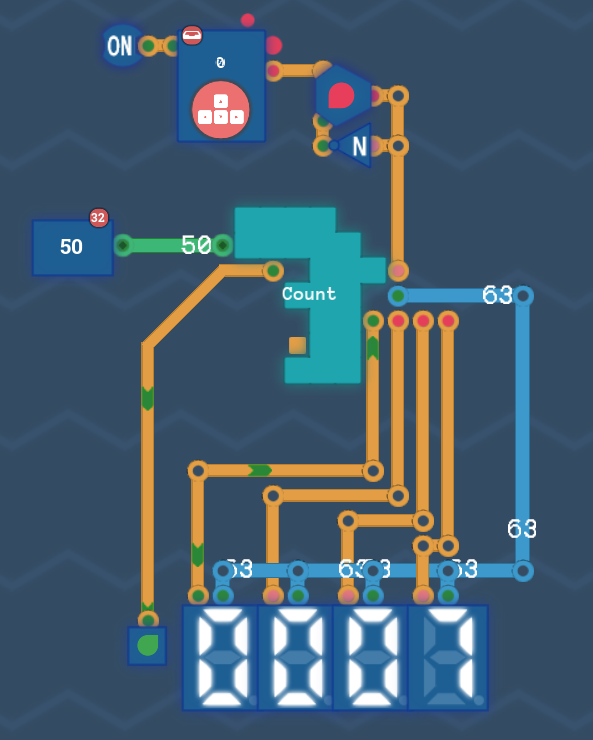
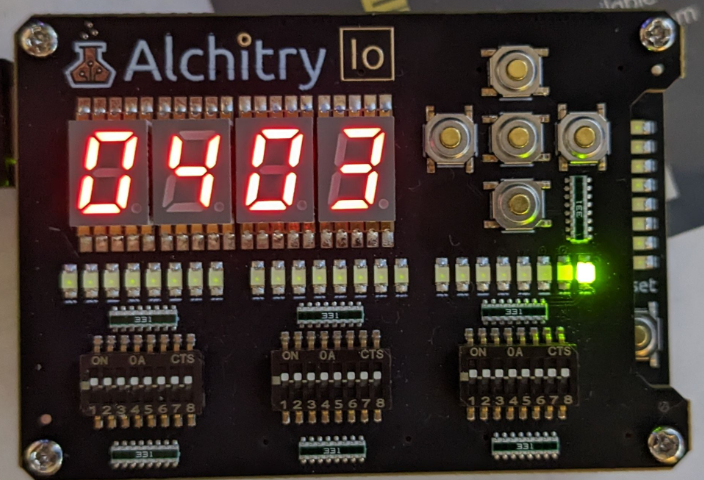
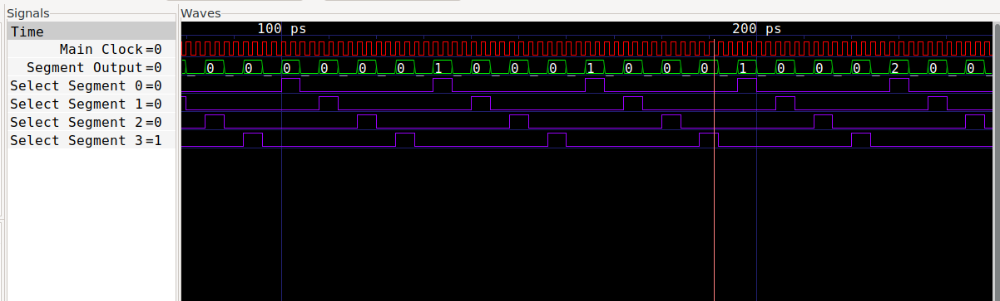

# Turning Complete + FPGA

The project aims to get [Turing Complete](https://turingcomplete.game/) design running on a real FPGA!
Turning complete (TC) added Verilog export and allowed us to load the design onto an FPGA.

Additionally, we are able to use external tools to simulate the circuite such as Verilator and view the waveform in gtkwave.

## Toolchain

I'm using the `oss-cad-suite-build` toolchain to get pre-compiled binarys for my platform.
You can find the tools at the following location.

https://github.com/YosysHQ/oss-cad-suite-build

## Building

Make sure the above tool chain is in your path and run `make`

Note that I've only tested this on a Linux machine.
